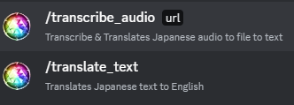
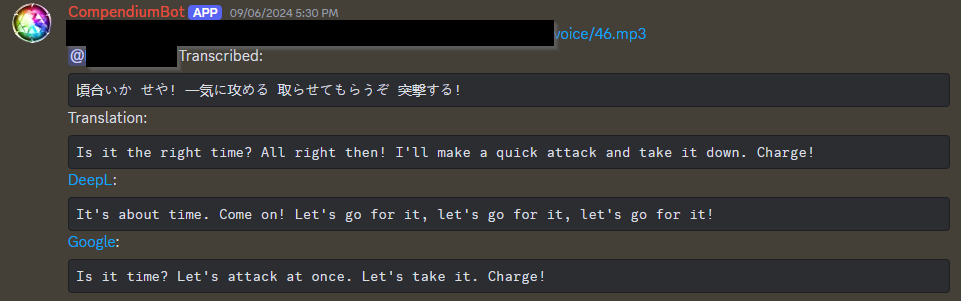

# Discord Transcribe & Translate Bot

This is a quick example of a translation bot for Discord. It translates either text or a url to an audio file to English text. It currently only works with **Japanese to English** but can be edited however you like.

## Requirements

If you want to take full advantage of all features you'll need:

- [Discord Bot Token](https://discord.com/developers/applications) - Must have a 'Application" set up for the bot to run on.
- [NodeJS](https://nodejs.org/en) - The scripting language the bot is written in.
- [OpenAI API access](https://platform.openai.com/docs/api-reference/introduction) - Can pay as you go and $5 can get you thousands of requests
- [DeepL](https://www.deepl.com/en/pro/change-plan) - Free account allows API request

## Set up

After you have installed and set up all accounts in [Requirements](#requirements), clone this git and run the npm command to install all packages

``npm i``

Then create a `.env` file in the root directory with the following info below:

```env
# Discord Bot Token
DISCORD_TOKEN = hp6uKPGh1XqUiRzRNUj1E3aFjXX1o0GtVw8lnBrB6TDUX57sLUarAFT1LmjE
# Discord Application ID
DISCORD_CLIENT_ID = 000000000000000000
# Discord Server ID
DISCORD_GUILD_ID = 000000000000000000
# Discord Channel ID the bot replys in
BOT_CHANNEL_ID = 000000000000000000
# OpenAI access key
OPENAI_API_KEY = PHjukr9FiRG1iqXjwivx8sJ4X368c3BKdeUumzi3JliRvA8f6D5wMATfpatI
# DeepL access key
DEEPL_KEY = eyNfQkH9T8ho7DtnZkMnVvBRrnPI6e30mQ9cek9wwdTgF5OcFeq9WYOVd3j
```

You should then be able to run the bot with the following command:

``npm run start``

## Usage

After the bot is running, you will have 2 commands on your Discord server, **/transcribe_audio** and **/translate_text**.



**Note:** These commands will be accessable to anyone with access to the bot. If you want to limit them to roles and such, you'll have to edit the code. There is a timeout of 1 command per user per 10 seconds to prevent spam.

- **/transcribe_audio** - Accepts a URL that to an audio file. URL must be accessable to the bot. I have not tested it with Google Drive links or other services where they might limit bot access. Bot then temporarily downloads the file to upload to ChatGPT to transcribe. Once it has the Japanese text of the audio, it sends it to the other services for translation.

- **/translate_text** - Accepts Japanese text to translate to English.

Both commands give you the Japanese text, the English translation from ChatGPT gpt-3.5-turbo-instruct then the Google Translate and DeepL translations with direct links to the site.



## Dev Notes

- The Google translations are a little hacky as they pulled from a URL request, not an API request. **Might break in the future.**
- The script console.logs all command as they happen. **It does not save logs for later viewing.** Once the program is closed, they are gone.
- The script **DOES save translations per site.** So in the event the same text is requested multiple times, it will return the previous returned translation. **If you wish to clear these old translations, they can be found in the src/trans folder.**
